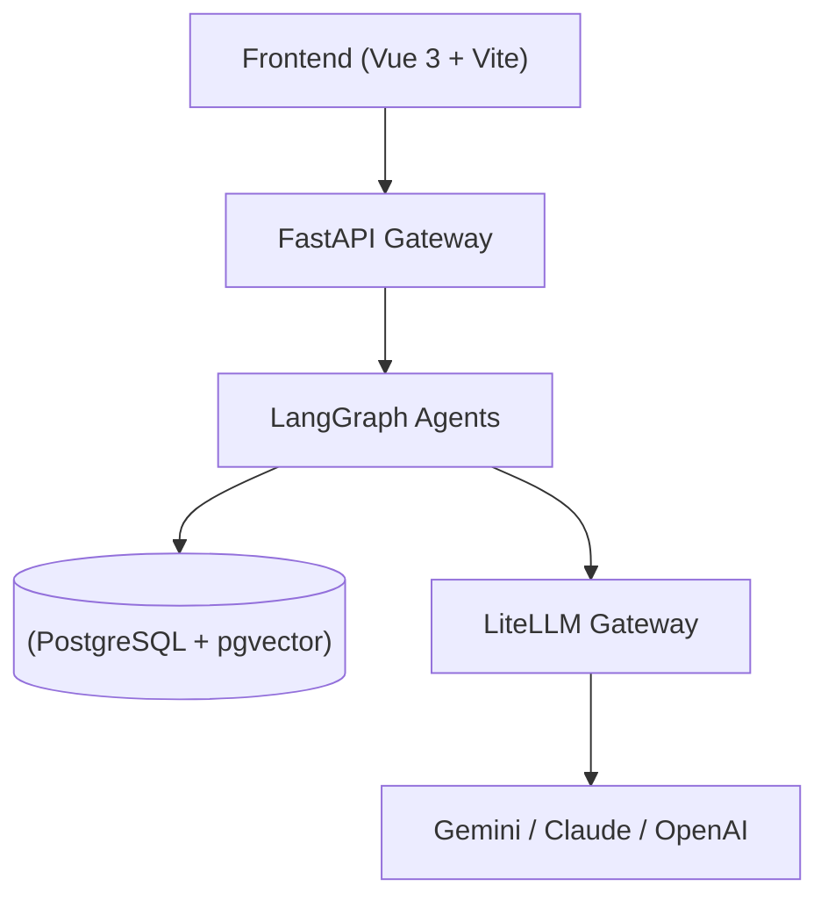

# Logos - 个人 AI 操作系统基础

基于 Docker Compose 构建的高代码 AI 助手系统，采用 **Vue 3 + Vite** 作为前端、**FastAPI** 作为后端网关、**LiteLLM** 作为多模型调度中心，并集成了强大的 **LangGraph** 多智能体工作流。

## 核心特性

- **多智能体联邦 (LangGraph Federation)**:
  - **TRPG GM**: 具备对抗式工作流（Storyteller + Rules Lawyer）的专业跑团主持人。
  - **Writer**: 小说家与编剧模式，支持 StoryBible 设定集维护与 Reflexion 循环优化。
  - **Coach/Psychologist**: 具备并行用户画像建模与危机干预能力的心理疏导与教练。
  - **Researcher/Coder**: 共享 RAG 引擎，支持大规模文档与代码库的精准检索。
- **现代前端交互**: 基于 Vue 3 + Naive UI 构建的沉浸式对话界面，支持语义化 CSS 设计。
- **Gemini-Distill 视觉解析 Engine**: 专为规则书与复杂文档设计的视觉解析引擎。
- **抗幻觉术语系统 (Glossary Editor)**: 全局术语表硬性约束，确保 AI 输出术语一致性。
- **数据持久化**: 基于 PostgreSQL + pgvector 实现的长短期记忆与向量检索。

## 智能体协调机制

本项目通过 **LangGraph** 实现了一套层次化的智能体协调系统：

1.  **Lobby 分发模式 (Router Pattern)**: 
    - 所有的用户请求首先进入 `LobbyAgent`。
    - `LobbyAgent` 负责意图识别与权限检查，生成 **Handoff Payload**（交接负载），将请求精准投递给下游专业智能体。
2.  **状态共享与持久化**:
    - 基于 `LangGraph State` 实现跨节点的短期记忆传递。
    - 使用 PostgreSQL + pgvector 实现跨会话的长期记忆与向量检索。

## 智能体深度解析 (Agent Deep Dive)

本项目内置了四种核心智能体，每种均基于不同的设计模式与工作流：

### 1. TRPG GM (Game Master)
*   **设计思路**: “对抗式叙事”与“硬核规则推演”。GM 不仅仅是一个对话者，它是一个维护游戏世界状态的系统。
*   **工作流程**:
    - **IntentParser**: 实时解析玩家输入，判断是纯对话、查询规则还是尝试发起行动（Action）。
    - **ActionHandler**: 自动化规则检定。集成骰子工具与规则书 RAG，处理诸如 (Blades in the Dark) 的压力位、后果与动作结果。
    - **Narrator (Reflexion)**: 基于骰子结果生成叙事。内部包含“叙事者”与“逻辑检查员”的循环，确保叙事既符合画面感又符合游戏规则。
*   **核心特性**: 高度集成的骰子系统、实时状态存盘、Noir 风格叙事驱动。

### 2. Novelist / Writer
*   **设计思路**: “共创式写作”与“知识库硬约束”。
*   **工作流程**:
    - **LoreRetriever**: 从 `StoryBible` (设定集) 中检索当前剧情相关的角色、地理与历史背景。
    - **Drafter**: 执行初稿创作，支持小说 (Prose) 与剧本 (Script) 两种模式。
    - **Critic & Reviser (Reflexion)**: 自动检查稿件的逻辑漏洞（如已死亡角色复活）与术语一致性，进行多轮迭代优化。
    - **LoreExtractor**: 自动根据新生成的剧情内容，提取新的设定（新角色、新地点）并反向更新 `StoryBible`。
*   **核心特性**: StoryBible 自动维护、反思循环优化、Prose 精修。

### 3. Life Coach / Psychologist
*   **设计思路**: “并行画像建模”与“情感安全锁”。
*   **工作流程**:
    - **ProfileLoader**: 启动时从 pgvector/Postgres 加载用户的长期心理画像（如性格特质、沟通偏好）。
    - **SafetyGuard**: 毫秒级关键词过滤与情绪探测，一旦检测到危机倾向立即禁言 AI 并触发 `CrisisResponse`。
    - **Responder & Profiler (Parallel Fork)**: 
        - 支路 A：快速生成共情式回复（支持 Psychologist/Coach 双人格切换）。
        - 支路 B (异步)：分析当前对话，更新用户的心流状态与心理档案，无需等待响应。
*   **核心特性**: 异步画像更新、危机干预系统、多重咨询模型。

### 4. Deep Researcher / Coder
*   **设计思路**: “视觉增强 RAG”与“循证合成”。
*   **工作流程**:
    - **Query Expansion**: 将用户模糊的问题拆解为多个子检索词。
    - **Vision Enhancement**: 搜索时同时检索文本与 `StatBlock` (视觉解析出的表格/图表数据)。
    - **Citation Synthesis**: 生成回答时严格要求标注来源 ID 与页码（如 `[Doc ID: Page X]`），不支持幻觉。
*   **核心特性**: 支持图表解析数据检索、严格引用溯源、代码库感知。

## 架构



## 服务列表

| 服务 | 端口 | 说明 |
|------|------|------|
| Frontend | 5173 | Vue 3 交互界面 |
| API Gateway | 8000 | FastAPI 后端服务 |
| LiteLLM | 4000 | 多模型调度与 API 聚合 |
| PostgreSQL | 5432 | 向量与状态数据库 |

## 项目结构

```
Logos/
├── backend/                # 核心逻辑
│   ├── agents/             # 智能体业务逻辑
│   ├── gateway/            # API 入口与生命周期 (FastAPI)
│   ├── graph/              # LangGraph 工作流定义
│   └── database/           # 数据模型与向量检索
├── frontend/               # 现代前端
│   └── src/                # Vue 源代码 (Naive UI)
├── infra/                  # Docker & 容器化配置
├── tests/                  # 自动化测试 (Pytest)
└── main.py                 # 后端统一入口
```

## 开发与扩展

本项目采用 `uv` 进行 Python 依赖管理。
- **启动后端**: `uv run uvicorn main:app --reload`
- **运行测试**: `uv run pytest`
- **前端开发**: `cd frontend && npm run dev`
- **容器部署**: `docker-compose -f infra/docker-compose.yml up -d`
