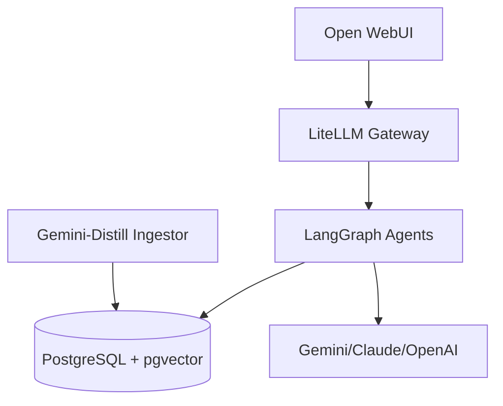

# Logos - 个人 AI 操作系统基础

基于 Docker Compose 构建的高代码 AI 助手系统，采用 Open WebUI 作为前端、LiteLLM 作为 API 网关、PostgreSQL + pgvector 作为底层存储，并集成了强大的 **LangGraph** 多智能体工作流。

## 核心特性

- **多智能体联邦 (LangGraph Federation)**:
  - **TRPG GM**: 具备对抗式工作流（Storyteller + Rules Lawyer）的专业跑团主持人。
  - **Writer**: 小说家与编剧模式，支持 StoryBible 设定集维护与 Reflexion 循环优化。
  - **Coach/Psychologist**: 具备并行用户画像建模与危机干预能力的心理疏导与教练。
  - **Researcher/Coder**: 共享 RAG 引擎，支持大规模文档与代码库的精准检索。
- **Gemini-Distill 视觉解析 Engine**: 专为规则书与复杂文档设计的视觉解析引擎，支持结构化 JSON 提取。
- **抗幻觉术语系统 (Glossary Editor)**: 全局术语表硬性约束，确保 AI 输出术语一致性。
- **数据持久化**: 基于 PostgreSQL + pgvector 实现的长短期记忆、向量检索与对话状态存盘。

## 架构



## 环境要求

- Docker Engine 24+
- Docker Compose v2
- uv (Python 包管理工具)

## 快速开始

```bash
# 1. 初始化环境变量
cp infra/.env.example infra/.env
# 编辑 infra/.env 填入 API 密钥

# 2. 启动基础服务
./scripts/init.sh up

# 3. 初始化数据库与环境 (Alembic 迁移)
python scripts/bootstrap.py

# 4. 运行测试验证
uv run pytest tests/test_full_stack.py
```

## 服务列表

| 服务 | 端口 | 说明 |
|------|------|------|
| Open WebUI | 3000 | AI 对话界面 |
| LiteLLM | 4000 | 多模型 API 网关 |
| API Gateway | 8000 | LangGraph Agents 服务入口 (FastAPI) |
| PostgreSQL | 5432 | 向量数据库 |

## 项目结构

```
Logos/
├── src/                    # 核心代码
│   ├── agents/             # 各类智能体实现 (GM, Writer, Coach...)
│   ├── database/           # SQLAlchemy 模型与 Alembic 迁移
│   ├── graph/              # LangGraph 状态定义
│   └── ingest/             # Gemini-Distill 视觉解析引擎
├── infra/                  # Docker 基础设施与配置
├── tests/                  # 完备的测试套件
├── scripts/                # 自动化初始化与管理脚本
└── pyproject.toml          # uv 项目管理
```

## 开发与扩展

本项目采用 `uv` 进行依赖管理。
- 添加依赖: `uv add <package>`
- 运行测试: `uv run pytest`
- 数据库迁移: `alembic revision --autogenerate -m "description"` 然后 `alembic upgrade head`
